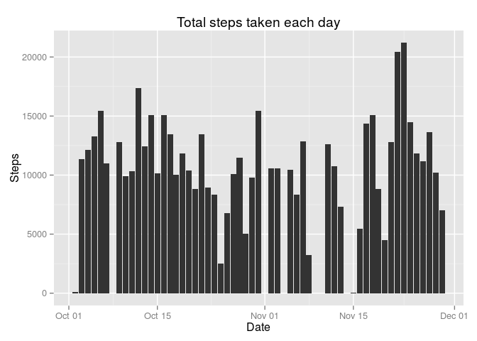
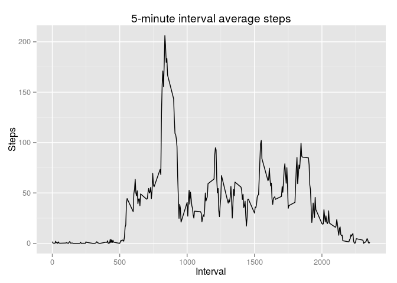
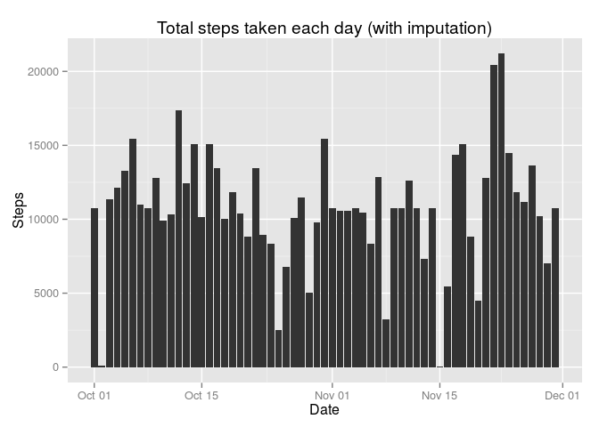
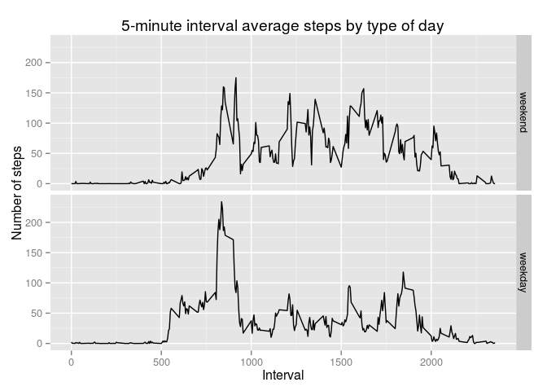

# Reproducible Research: Peer Assessment 1

```r
library(knitr)
library(ggplot2)

Sys.setlocale("LC_TIME", "en_US.UTF-8")
```

```
## [1] "en_US.UTF-8"
```

```r
opts_chunk$set(echo = TRUE)
```

## Loading and preprocessing the data

1. Load the data (i.e. read.csv())
2. Process/transform the data (if necessary) into a format suitable for your analysis

```r
if (!file.exists("activity.csv")) {
  unzip(zipfile = "activity.zip")
}
activity.orig <- read.csv(file = "activity.csv", sep = ",", colClasses=c("integer", "Date", "integer"))
activity.df <- na.omit(activity.orig)
```

## What is mean total number of steps taken per day?

1. Calculate the total number of steps taken per day

```r
activity.daily.totals <- aggregate(activity.df$steps, by = list(activity.df$date), FUN = sum)
colnames(activity.daily.totals) <- c("date", "steps")
```

2. Make a histogram of the total number of steps taken each day:

```r
ggplot(data = activity.daily.totals, aes(x = date, y = steps)) +
  geom_histogram(stat = "identity") +
  labs(title = "Total steps taken each day", x = "Date", y = "Steps")
```

 

2. Calculate and report the *mean* and *median* total number of steps taken per day:

```r
mean(activity.daily.totals$steps)
```

```
## [1] 10766.19
```

```r
median(activity.daily.totals$steps)
```

```
## [1] 10765
```
## What is the average daily activity pattern?

1. Make a time series plot (i.e. type = "l") of the 5-minute interval (x-axis) and the average
number of steps taken, averaged across all days (y-axis)

```r
activity.int.means <- aggregate(activity.df$steps, by = list(activity.df$interval), FUN = mean)
colnames(activity.int.means) <- c("interval", "steps")
activity.int.means <- activity.int.means[with(activity.int.means, order(interval)),]

ggplot(activity.int.means, aes(interval, steps)) +
  geom_line() +
  labs(title = "5-minute interval average steps", x = "Interval", y = "Steps")
```

 

2. Which 5-minute interval, on average across all the days in the dataset, contains the maximum
number of steps?

```r
activity.int.means$interval[which.max(activity.int.means$steps)]
```

```
## [1] 835
```

## Imputing missing values

1. Calculate and report the total number of missing values in the dataset (i.e. the total number
of rows with NAs)

```r
sum(is.na(activity.orig$steps))
```

```
## [1] 2304
```

2. Devise a strategy for filling in all of the missing values in the dataset. The strategy does
not need to be sophisticated. For example, you could use the mean/median for that day, or the
mean for that 5-minute interval, etc.
```
#  I will fill missing values with their interval's mean across other days.
```

3. Create a new dataset that is equal to the original dataset but with the missing data filled
in.

```r
# First create a copy of activity.orig
activity.imp <- as.data.frame(activity.orig)

for (i in which(is.na(activity.imp$steps))) {
  interval <- activity.imp$interval[i]
  activity.imp$steps[i] <- activity.int.means[which(activity.int.means$interval == interval),]$steps
}
```

4. Make a histogram of the total number of steps taken each day and Calculate and report the
*mean* and *median* total number of steps taken per day. Do these values differ from the estimates
from the first part of the assignment? What is the impact of imputing missing data on the
estimates of the total daily number of steps?

```r
activity.imp.daily.totals <- aggregate(activity.imp$steps, by = list(activity.imp$date), FUN = sum)
colnames(activity.imp.daily.totals) <- c("date", "steps")

ggplot(data = activity.imp.daily.totals, aes(x = date, y = steps)) +
  geom_histogram(stat = "identity") +
  labs(title = "Total steps taken each day (with imputation)", x = "Date", y = "Steps")
```

 

```r
mean(activity.imp.daily.totals$steps)
```

```
## [1] 10766.19
```

```r
median(activity.imp.daily.totals$steps)
```

```
## [1] 10766.19
```

```r
#  Imputation with the mean values shifted the median to equal the mean,
#  while the mean remains unchanged.
```
## Are there differences in activity patterns between weekdays and weekends?

1. Create a new factor variable in the dataset with two levels -- "weekday" and "weekend"
indicating whether a given date is a weekday or weekend day.


```r
activity.df$dayClass <- as.factor(ifelse(is.element(weekdays(activity.df$date),
                                                    c("Saturday", "Sunday")),
                                         "weekend", "weekday"))
```

2. Make a panel plot containing a time series plot (i.e. type = "l") of the 5-minute interval
(x-axis) and the average number of steps taken, averaged across all weekday days or weekend
days (y-axis). The plot should look something like the following, which was created using
simulated data:


```r
activity.int.means.wd <- aggregate(activity.df$steps,
                                   list(activity.df$interval, activity.df$dayClass),
                                   FUN = mean)
colnames(activity.int.means.wd) <- c("interval", "dayClass", "steps")

# reorder the factors to place weekend on top, as in the example
activity.int.means.wd$dayClass <- factor(activity.int.means.wd$dayClass,
                                         levels = c("weekend", "weekday"))

ggplot(activity.int.means.wd, aes(interval, steps)) +
  geom_line() +
  facet_grid(dayClass ~ .) +
  labs(title = "5-minute interval average steps by type of day", x = "Interval", y = "Number of steps")
```

 
